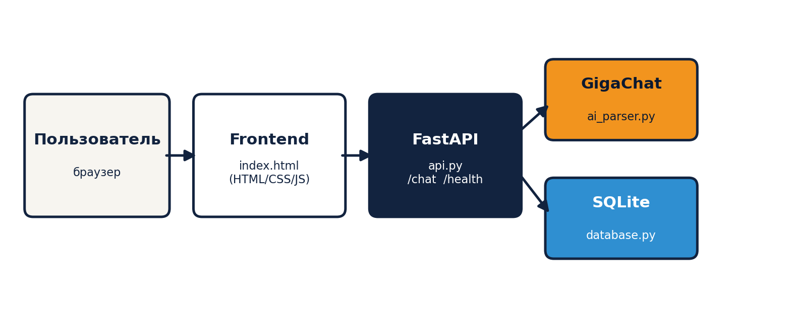
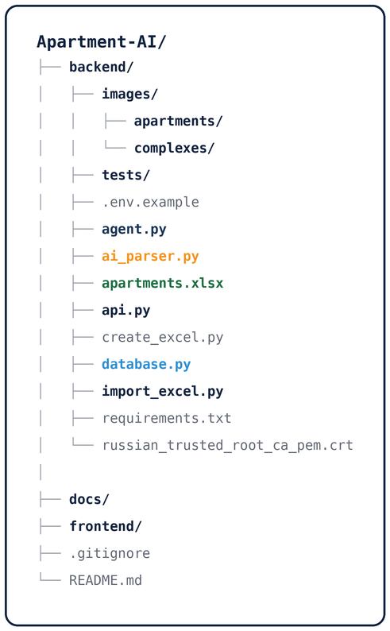

# **AI-агент для автоматизации подбора квартир в жилых комплексах ГК «ДСК».**

Агент понимает запросы пользователя на естественном языке, уточняет недостающие параметры, подбирает подходящие квартиры из актуального каталога, показывает информацию о жилых комплексах, сравнивает варианты, предлагает альтернативы и поддерживает бронирование.

## ✨ Возможности

- понимание запросов на естественном языке;
- определение количества комнат, площади, бюджета и этажа;
- уточнение недостающих параметров;
- изменение ранее заданных фильтров без потери контекста диалога;
- поиск доступных квартир;
- автоматическое исключение забронированных квартир из результатов;
- рекомендации наиболее подходящего варианта;
- подбор ближайших альтернатив, если точных совпадений нет;
- просмотр списка жилых комплексов;
- выбор одного или нескольких ЖК;
- сравнение жилых комплексов;
- информация о жилых комплексах;
- выбор квартиры из результатов поиска;
- информация о конкретной квартире;
- сравнение квартир;
- контекстные запросы в диалоге;
- бронирование квартиры на выбранный срок;
- автоматическое разделение контекста разных пользовательских сессий;
- передача запроса менеджеру;
- отображение изображений ЖК и квартир через API.

## 🏗️ Архитектура



## 🧩 Основные компоненты

### 🖥️ $\color{#12233F}{\textsf{Frontend}}$
Пользовательский интерфейс и отображение результатов.

### ⚡ $\color{#12233F}{\textsf{FastAPI}}$ (`api.py`)
API-слой для взаимодействия frontend и backend.

### 🤖 $\color{#1B3657}{\textsf{ApartmentAgent}}$ (`agent.py`)
Основная логика AI-агента и управление контекстом диалога.

### $\color{#F2941E}{\textsf{GigaChat}}$ (`ai_parser.py`)
Используется для понимания естественного языка и обработки сложных запросов.

### $\color{#2F8FD1}{\textsf{SQLite}}$ (`database.py`)
Рабочая база данных с информацией о ЖК, квартирах и состоянии бронирования.

### Excel (`apartments.xlsx`)
Каталог квартир и жилых комплексов, который может обновляться без изменения программного кода.

### Импорт данных (`import_excel.py`)
Синхронизация каталога Excel с рабочей $\color{#2F8FD1}{\textsf{SQLite}}$-базой.

## Работа с данными

$\color{#2F8FD1}{\textsf{SQLite}}$ используется как рабочая база данных приложения.

В ней хранятся:

- жилые комплексы;
- квартиры;
- характеристики квартир;
- изображения;
- текущее состояние бронирования.

Excel используется как каталог данных, который может поддерживаться менеджером без изменения программного кода.

В `apartments.xlsx` хранятся:

- количество комнат;
- площадь;
- цена;
- этаж;
- отделка;
- балкон/лоджия;
- информация о ЖК;
- изображения.

Для синхронизации используется `import_excel.py`.

**При импорте:**

- существующие ЖК и квартиры обновляются;
- новые записи добавляются;
- характеристики квартир и ЖК актуализируются;
- данные бронирования (`booking_status`, `booking_type`, `booking_until`) не перезаписываются данными из Excel.

Таким образом, Excel используется как актуальный каталог недвижимости, а $\color{#2F8FD1}{\textsf{SQLite}}$ — как рабочее хранилище приложения с динамическим состоянием бронирования.

## Использование $\color{#F2941E}{\textsf{GigaChat}}$

Агент использует $\color{#F2941E}{\textsf{GigaChat}}$ API через официальный Python SDK.

$\color{#F2941E}{\textsf{GigaChat}}$ применяется для задач, связанных с пониманием естественного языка, в том числе:

- извлечения параметров из пользовательского запроса;
- определения намерения пользователя;
- выбора жилого комплекса по естественному описанию;
- обработки сложных информационных запросов;
- сравнения объектов.

Для простых и однозначных запросов часть обработки выполняется правилами и регулярными выражениями, что позволяет уменьшить количество обращений к модели.

## API

Backend предоставляет два основных endpoint:

### Проверка состояния

`GET /health`

**Ответ:**

```json
{
  "status": "ok"
}
```

### Обработка сообщения

`POST /chat`

**Тело запроса:**

```json
{
  "session_id": "user-123",
  "message": "Покажи двушки до 12 миллионов"
}
```

`session_id` используется для сохранения контекста конкретного пользователя.

**Пример ответа:**

```json
{
  "type": "search",
  "message": "Найдены подходящие варианты.",
  "filters": {
    "rooms": 2,
    "max_price": 12000000,
    "min_area": null,
    "max_area": null,
    "max_floor": null
  },
  "apartments": []
}
```

Тип ответа определяется backend и позволяет frontend отображать соответствующий сценарий:

- `search` — результаты поиска;
- `alternative` — альтернативные варианты;
- `clarification` — уточняющий вопрос;
- `selection` — выбор объекта;
- `information` — информация;
- `comparison` — сравнение;
- `booking` — бронирование;
- `payment` — оплата;
- `manager` — передача запроса менеджеру;
- `error` — ошибка.

## Изображения

Изображения доступны через $\color{#12233F}{\textsf{FastAPI}}$ по адресу:

`/images/...`

Изображения жилых комплексов находятся в:

`backend/images/complexes/`

Изображения квартир находятся в:

`backend/images/apartments/`

Пути к изображениям передаются frontend в JSON-ответах API.

## Структура проекта



## Установка и запуск проекта с нуля

**Шаг 1 — клонируй репозиторий**
```json
git clone https://github.com/astireh/Apartment-AI.git
cd Apartment-AI/backend
```
**Шаг 2 — создай и активируй виртуальное окружение**
```json
python -m venv venv
Set-ExecutionPolicy -Scope Process -ExecutionPolicy Bypass
venv\Scripts\activate
```
**Шаг 3 — поставь зависимости**
```json
pip install -r requirements.txt
```
**Шаг 4 — настрой GigaChat**
Создай файл .env в папке backend/ (по образцу .env.example):
```json
GIGACHAT_CREDENTIALS=твои_credentials
```
Получить их можно на https://developers.sber.ru/portal/products/gigachat

**Шаг 5 — запусти backend**
```json
uvicorn api:app --reload
```
**Шаг 6 — открой сайт**
Зайди в папку Apartment-AI/frontend, открой index.html двойным кликом в браузере. Backend должен продолжать работать в терминале.

## Пример диалога


## Бронирование

После выбора квартиры пользователь может начать бронирование.

Доступные варианты бронирования определяются backend.

Состояние бронирования хранится в $\color{#2F8FD1}{\textsf{SQLite}}$ и учитывается при последующем поиске квартир.

Забронированная квартира не отображается как доступная для других поисковых запросов.

## Безопасность

Секретные данные не хранятся непосредственно в исходном коде.

Credentials $\color{#F2941E}{\textsf{GigaChat}}$ находятся в `.env`, который исключён из Git.

Рабочая база $\color{#2F8FD1}{\textsf{SQLite}}$ также не загружается в репозиторий.

## Технологии

- Python 3.13+
- $\color{#12233F}{\textsf{FastAPI}}$
- Uvicorn
- $\color{#F2941E}{\textsf{GigaChat}}$ API
- `gigachat` Python SDK
- $\color{#2F8FD1}{\textsf{SQLite}}$
- Pydantic
- OpenPyXL
- HTML/CSS/JavaScript — frontend

## Назначение проекта

Проект разработан как прототип AI-агента для автоматизации первичной обработки обращений покупателей недвижимости.

Агент позволяет сократить количество ручных действий менеджера на этапе первичного подбора квартиры и предоставить пользователю быстрый доступ к актуальной информации о квартирах и жилых комплексах
